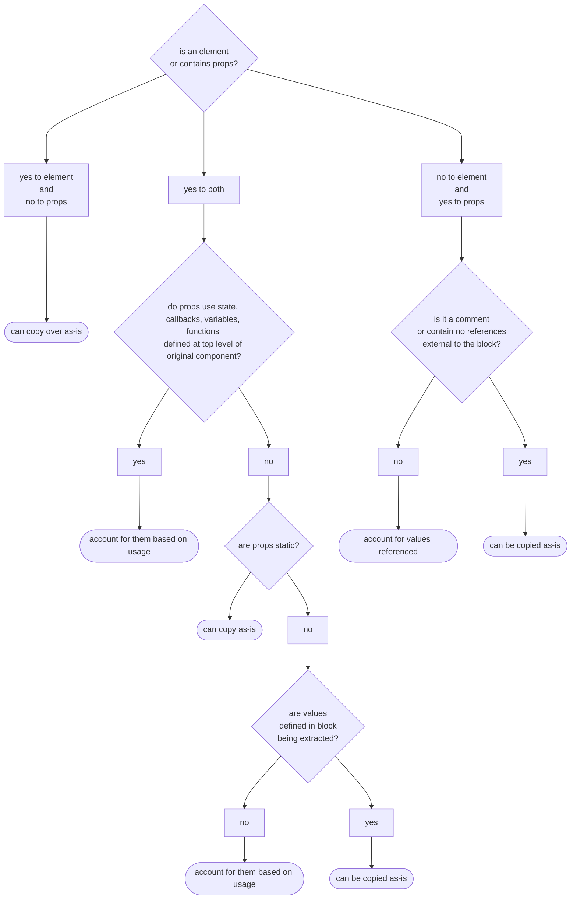

<!-- h1, h2 already used by CTD Learns -->

### Introduction

As your React applications grow in complexity, maintaining clean, organized, and reusable code becomes increasingly important. In previous weeks, you've built a functional todo application with state management, event handling, and controlled components. While this works well for smaller projects, larger applications can quickly become difficult to manage without proper organization and code structure.

This week, we'll focus on transforming your growing codebase into a well-organized, maintainable application. You'll learn how to identify opportunities for creating reusable components, organize your project files effectively, and refactor existing code to improve readability and maintainability. These practices are essential for building scalable React applications and working effectively in team environments.

By the end of this week, you'll understand how to break down complex components into smaller, focused pieces, organize your project structure for long-term success, and apply refactoring techniques that make your code more professional and easier to work with. These skills will serve as the foundation for building more sophisticated applications in the coming weeks.

### Reusable Components

Components are one of the fundamental building blocks of any React application. One of their main strengths is reusability. By writing components once and instantiating them as needed, we can streamline development and improve code maintainability. Certain elements in a UI tend to repeat themselves. These repeated elements might look same but contain different content. Conversely, they may have slightly different appearances but are structurally similar. These include:

- article excerpts on a blog's home page
- product cards
- list items
- day boxes in a calendar

We have already seen a few examples of repeated elements in CTD Swag. The blurred out product cards and the shopping cart items are both elements that repeat themselves. In fact, we've already had some experience with the card components. The shopping cart items are a prime example of an element that can be turned into a re-usable component. Inside of the `Cart` component, we map over the `workingCart` to create each list item. Rather than housing the code in `Cart` component, it can be extracted out to a `CartItem` component. Doing so saves space in the existing component file plus make it easier to read.


Another category of reusable components are elements that are used throughout an interface that allow user to navigate or interact with the page. They can also be visual details that unify the look and feel of an interface. Such components could include:

- buttons
- tooltips
- dialog boxes
- navigation menus
- forms

Any visual element is a candidate to become a reusable component as long as 2 criteria are met. 1.) They accept the same props and 2.) they have the same underlying structure. If we also take advantage of default props values and children props, we can further increase opportunities for creating re-usable components. Lets step away from CTD Swag to examine a `Dialog` component to see how we can make it into a flexible, reusable component.

Dialog boxes convey messages to users based on their actions, such as success messages, error notifications, or warnings, or general information the user may need. A typical dialog box consists of its container, a heading, message, and one or more buttons to take an action on the message.


Below is the equivalent code, excluding styles to neaten up the dialog's appearance.

```jsx
//Dialog.jsx

import info from './assets/info.svg';

export function Dialog() {
  return (
    <div className="dialog">
      <div className="heading">
        <p>INFO dialog</p>
        <div className="icon">
          
        </div>
      </div>
      <div className="content">
        Lorem, ipsum dolor sit amet consectetur adipisicing elit. Possimus
        exercitationem quos quam, nihil cum voluptates tempore enim! Vel,
        provident adipisci quos, similique iusto repellendus culpa obcaecati
        libero, nostrum reiciendis quidem.
      </div>
      <div className="controls">
        <button>Okay</button>
      </div>
    </div>
  );
}
```

We can categorize the information that we provide into one of several categories: **info**, **success**, **error**, or **warning**. Each one of these are commonly associated with colors and icons to help convey the message's tone to the user. Adding these to our dialog could help our user better understand the information that we are trying to convey.

- success: green, ✔️ (check mark)
- error: red, ❌ (cross mark - not to be confused with x or X)
- warning: yellow, ⚠️ (warning)
- info: no color or blue, ℹ️ (information)

> [!NOTE]
> Do not rely on color alone! [Around 300 million people](https://my.clevelandclinic.org/health/diseases/11604-color-blindness) around the world have some form of color blindness. This is why it's important to also include an icon when using any sort of color coding. More information about common color accessibility issues can be found on [Deque's website](https://www.deque.com/blog/3-common-color-accessibility-issues-one-can-easily-avoid/). They are a maker of a popular suite of accessibility tools.

The first step in making a `Dialog` component extensible is to add a `kind` prop to the `Dialog`'s definition. We'll set it to default value of "info" since that's the most generic category and can act as the default fallback. We can then use that prop to configure the rest of the component.

- import images for each category and create an image lookup object
- create a background-color lookup object
- add in a background style for the dialog's heading
- update the image's src using the props and image lookup object

Our updated `Dialog` component code now looks like:

```jsx
//Dialog.jsx
import error from './assets/error.svg';
import info from './assets/info.svg';
import success from './assets/success.svg';
import warning from './assets/warning.svg';

const images = {
  error,
  info,
  success,
  warning,
};

const colors = {
  error: '#f6bed7',
  info: '#bec7f6',
  success: '#bef6c5',
  warning: '#f6eebc',
};

export function Dialog({ kind = 'info' }) {
  return (
    <div className="dialog">
      <div className="heading" style={{ backgroundColor: colors[kind] }}>
        <p>{kind.toUpperCase()} dialog</p>
        <div className="icon">
          
        </div>
      </div>
      <div className="content">
        Lorem, ipsum dolor sit amet consectetur adipisicing elit. Possimus
        exercitationem quos quam, nihil cum voluptates tempore enim! Vel,
        provident adipisci quos, similique iusto repellendus culpa obcaecati
        libero, nostrum reiciendis quidem.
      </div>
      <div className="controls">
        <button>Okay</button>
        <button>Dismiss</button>
      </div>
    </div>
  );
}
```

We then go back to the parent component and pass a `kind` props into the instance of `Dialog` component. Finally, add some buttons that will let us toggle between the dialogs.

```jsx
//App.jsx
import { useState } from 'react';
import { Dialog } from './Dialog';

const dialogKind = {
  error: 'error',
  info: 'info',
  success: 'success',
  warning: 'warning',
};

function App() {
  const [kind, setKind] = useState(dialogKind.info);
  return (
    <>
      <main>
        <Dialog kind={kind} />
        <div className="buttonWrapper">
          <button onClick={() => setKind(dialogKind.error)}>Error</button>
          <button onClick={() => setKind(dialogKind.info)}>Info</button>
          <button onClick={() => setKind(dialogKind.success)}>Success</button>
          <button onClick={() => setKind(dialogKind.warning)}>Warning</button>
        </div>
      </main>
    </>
  );
}

export default App;
```


The dialog has a default `kind` when first rendered and when changed, it displays a different color and a helpful icon in its heading. Suppose that we have messages that come from an API response that we wanted to include them instead of the static paragraph we currently had. We have two options with this approach - we can add a `message` props or we can place the message into the instance using `children` props. Using the `children` approach has the added advantage that we can further format the message or include other jsx.

To do this, we'll add a `children` props to `Dialog` component's definition and replace the paragraph of [lorem ipsum](https://en.wikipedia.org/wiki/Lorem_ipsum) text with `{children}`. This acts as an outlet for any jsx nested in between the component instance's tags.

```jsx
//excerpts from Dialog.jsx
export function Dialog({ children, kind = 'info' }) {
//component code...
 return (
     <div className="dialog">
       <div className="heading" style={{ backgroundColor: colors[kind] }}>
         <p>{kind.toUpperCase()} dialog</p>
         <div className="icon">
           
         </div>
       </div>
       <div className="content">{children}</div>
       <div className="controls">
         <button>Okay</button>
         <button>Dismiss</button>
       </div>
     </div>
 );
}
```

```jsx
//excerpts from App.jsx
function App() {
  const [kind, setKind] = useState(dialogKind.info);

  return (
    <>
      <main>
        <Dialog kind={kind}>
          {/*using curly brackets as text inside of jsx will confuse the compiler*/}
          {/*&#123; and &#125 are html character codes for { and }, respectively*/}
          <h2>Flexibility of children props</h2>
          <p>
            Anything that is placed here shows up in the document structure
            where the &#123;children&#125; props was placed inside the
            `.content` div of the Dialog component.
          </p>
        </Dialog>
        <div className="buttonWrapper">
          <button onClick={() => setKind(dialogKind.error)}>Error</button>
          <button onClick={() => setKind(dialogKind.info)}>Info</button>
          <button onClick={() => setKind(dialogKind.success)}>Success</button>
          <button onClick={() => setKind(dialogKind.warning)}>Warning</button>
        </div>
      </main>
    </>
  );
}
```


### Helper Functions and Custom Hooks

When refactoring React components, you'll often encounter logic that can be extracted to improve code organization, reusability, and testability. This logic typically falls into two categories: **helper functions** and **custom hooks**. Understanding when to use each approach is crucial for writing maintainable React applications.

#### Helper Functions

**Helper functions** are pure JavaScript functions that contain logic that doesn't depend on React's lifecycle or state management. They can be extracted from components when you have business logic, calculations, or data transformations.

**Characteristics:**

- No React hooks inside them
- Pure functions that take inputs and return outputs
- Business logic, calculations, data transformations
- Can be tested independently of React
- Can be used outside of React components

**Examples from CTD Swag context:**

```javascript
// Price calculation logic
function getCartPrice(cartItems) {
  return cartItems.reduce((total, item) => {
    return total + (item.price * item.itemCount);
  }, 0);
}

// Product sorting (from utils/sortByBaseName.js)
function sortByBaseName({ productItems, isSortAscending }) {
  return productItems.sort((a, b) => {
    if (isSortAscending) {
      return a.baseName.localeCompare(b.baseName);
    }
    return b.baseName.localeCompare(a.baseName);
  });
}

// Product filtering (from utils/filterByQuery.js)
function filterByQuery({ productItems, searchTerm }) {
  if (!searchTerm) return productItems;
  
  return productItems.filter(item => 
    item.baseName.toLowerCase().includes(searchTerm.toLowerCase()) ||
    item.description.toLowerCase().includes(searchTerm.toLowerCase())
  );
}

// Data transformation (from utils/convertInventoryToProducts.js)
function convertInventoryToProducts(inventory) {
  // Groups flat inventory array into products with variants
  const grouped = inventory.reduce((acc, item) => {
    if (!acc[item.baseName]) {
      acc[item.baseName] = [];
    }
    acc[item.baseName].push(item);
    return acc;
  }, {});
  
  return Object.values(grouped);
}
```

#### Custom Hooks

**Custom hooks** are functions that use React hooks internally and encapsulate stateful logic that can be shared between components.

**Characteristics:**

- Must start with "use"
- Can use other React hooks (useState, useEffect, etc.)
- Encapsulate stateful logic
- Return state and/or functions to update that state
- Component lifecycle aware

**Custom Hooks that Could be used in CTD-Swag:**

```javascript
// Shopping cart management (these examples are not implemented in the CTD Swag repo)
function useShoppingCart() {
  const [cart, setCart] = useState([]);
  
  const addItem = (product) => {
    setCart(prev => {
      const existing = prev.find(item => item.id === product.id);
      if (existing) {
        return prev.map(item => 
          item.id === product.id 
            ? {...item, itemCount: item.itemCount + 1}
            : item
        );
      }
      return [...prev, {...product, itemCount: 1}];
    });
  };
  
  const removeItem = (productId) => {
    setCart(prev => prev.filter(item => item.id !== productId));
  };
  
  const total = getCartPrice(cart); // Uses helper function
  
  return { cart, addItem, removeItem, total };
}

// Local storage persistence
function useLocalStorage(key, initialValue) {
  const [value, setValue] = useState(() => {
    try {
      const item = window.localStorage.getItem(key);
      return item ? JSON.parse(item) : initialValue;
    } catch (error) {
      return initialValue;
    }
  });

  useEffect(() => {
    try {
      window.localStorage.setItem(key, JSON.stringify(value));
    } catch (error) {
      console.error('Error saving to localStorage:', error);
    }
  }, [key, value]);

  return [value, setValue];
}
```

#### When to Extract Each

**Extract Helper Functions When:**

- Logic is pure (no side effects)
- No React state or lifecycle needed
- You want to unit test the logic separately
- Logic could be reused in non-React contexts
- Calculation, validation, or data transformation logic

**Extract Custom Hooks When:**

- Logic involves React state or effects
- Multiple components need the same stateful behavior
- You want to encapsulate complex state management
- Logic involves subscriptions, API calls, or timers
- You need to share component lifecycle logic

#### Best Practices

**Helper Functions:**

- Place in `src/utils/` or `src/services/` directories
- Keep them pure and predictable
- Make them easily testable
- Use clear, descriptive names

**Custom Hooks:**

- Place in `src/hooks/` directory
- Always start names with "use"
- Return objects for multiple values (better than arrays for readability)
- Document what state and functions they provide

#### Real-World CTD Swag Example

Instead of having this complex logic in a component:

```jsx
// Before - all logic in component
function Cart({ cart, setCart }) {
  // ...omitted code
  
  const updateQuantity = (id, newCount) => {
    setCart(prev => prev.map(item => 
      item.id === id ? {...item, itemCount: newCount} : item
    ));
  };
  
  const total = cart.reduce((sum, item) => sum + (item.price * item.itemCount), 0);
  const formattedTotal = `$${total.toFixed(2)}`;
  
  // ... rest of component
}
```

You could extract:

```jsx
// After - extracted helper and custom hook
// Helper function (utils/cartCalculations.js)
export function getCartPrice(cartItems) {
  return cartItems.reduce((total, item) => {
    return total + (item.price * item.itemCount);
  }, 0);
}

// Hypothetical custom hook - not currently implemented in CTD Swag
export function useCart(initialCart = []) {
  const [cart, setCart] = useState(initialCart);
  const [isLoading, setIsLoading] = useState(false);
  
  const updateQuantity = (id, newCount) => {
    setCart(prev => prev.map(item => 
      item.id === id ? {...item, itemCount: newCount} : item
    ));
  };
  
  const total = getCartPrice(cart); 
  
  return { cart, setCart, updateQuantity, total, isLoading, setIsLoading };
}

// Simplified component
function Cart() {
  const { cart, updateQuantity, total } = useCart();
  
  // Much cleaner component code
}
```

This separation makes code more maintainable, testable, and reusable!

### Organizing Files in a React Project

We inevitably add more components and refactor out non-React code into separate files as a project grows. If we maintain a flat file structure as the file count increases, it become challenging to navigate codebase or to see how files relate. In this section, we will discuss some considerations that go into determining the directory structure and organizing files for CTD Swag so we can continue to add functionality.

> [!note]
> The internet hosts many discussions and even more opinions about how to structure software projects. What we provide is a sensible approach that works well with small to medium React projects. Some larger projects require structures tailored to the problems that they solve. Other React projects using frameworks such as Next.js, Astro, Remix must adhere to rules prescribed by the framework since they tend to use specific directories for features such as page routing or asset management.

#### Details to Consider

Before we start reorganizing our project, we ask the following questions about each file or code passage as we review the project's contents:

- **What feature(s) does it support?** In the context of organizing a React project, a "feature" typically refers to a distinct and self-contained functionality or section of the application that serves a specific purpose. If a component supports multiple features, it's considered shared.
  - CTD Swag currently has 2 features: a list of items for sale and a checkout cart. This list will grow as we add more functionality.
  - The `ProductCard` is already componentized and is used inside of the list of items for sale. Since it is only meant for use with the cart, we group it with feature code related to `ProductList`.
  - Another portion of feature-related code is the checkout item - the elements that it uses have not been converted into component but will be as we refactor the project this week. Since it's only is found in a single feature, we'll group it with code related to `Cart`.
- **Does a component serve mostly as a layout structure or help organize the UI?** For example, is it a heading, footer, a sidebar, or help contain the main content of the app?
  - CTD Swag already includes a Header component and we will refactor out the footer into its own component this week.
- **Is it reused or does the same code show up in multiple places?**
  - Buttons, forms, and other reusable elements we discussed earlier should be considered here. We do not have any at this time but we can be assured that we will develop some so we can create a placeholder for them in the structure.
- **Does it help us work with a 3rd party library, data retrieval, or storage?**
  - This is not a question that we are ready to answer for CTD Swag. We don't implement any other libraries but we will eventually need a payment processing system. Processors such as Stripe, PayPal, or ApplePay provide developers with a software development kit (SDK) which include necessary resources to work with their platforms. We also don't implement LocalStorage, IndexedDB, or any APIs yet but will in future lessons. We can make a placeholder for these so we remember where they go.
- **Is it a helper utility that can function independently from React?**
  - `getCartPrice` in the Cart component is a function that tallies up the cost of each item in the cart. It doesn't rely on any React code. We could turn it into a helper utility since we may use it again during the checkout process we build later. For now, it will remain in place since we can take care of that refactor when we build the checkout feature. The same rationale applies to `getItemCount` in Header.

Answers for each of these questions help us determine how to group aspects of the codebase. We end up with an anticipated project structure that resembles the following:

```terminal
.
├── node_modules/
├── public/
│   └── .gitkeep
├── src/
│   ├── assets/
│   ├── fonts/
│   ├── icons/
│   ├── catalog.json
│   └── product images
├── features/
│   ├── ProductList/
│   ├── ProductList.jsx
│   └── ProductCard.jsx
│       └── Cart/
│           ├── Cart.jsx
│           └── CartItem.jsx (new component)
├── services/
│    └── .gitkeep
├── shared/
│   └── .gitkeep
│   └── layout/
│   ├── Footer.jsx (new component)
│   └── Header.jsx
├── .eslint.cjs
├── .gitignore
├── .prettierignore
├── .prettierrc
├── index.html
├── package-lock.json
├── package.json
├── README.md
└── vite.config.js
```

The outline below provides a few more notes on the directories.

- **assets/** - static resources such as fonts and images used for the UI
  - product images and catalog.json are for placeholder data until we establish an API to manage a live inventory
- **features/** - components grouped by functionality
  - if a feature does not need sub-components, its primary component can be placed directly in this folder
  - when features are refactored into sub-components, a folder of the same name as the feature is added to store all related files
  - any component used by multiple features gets moved to `shared/`
- **services/** - non-React functionality extracted from components
  - **.gitkeep** - placeholder file
- **shared/** - re-usable components that are used in more than one feature
  - **.gitkeep** - placeholder file
- **layout/** - components used to help organize and divide the UI into manageable pieces

### Refactoring a Project for Expansion

#### Create Directories and Organize Existing Files

To start the refactor, we create the new directories and move existing files into their updated location. As each file is moved, it's important to make sure that import statements are updated - both inside the file as well as wherever it is being imported. Running the dev server provides in-browser errors that is handy for letting us know where file imports are incorrect.


VS Code is helpful in making some of these updates automatically as we move around files too. Be careful to double-check the imports in the file being moved - VS Code may not recognize non-JavaScript imports. Being able to import images and other non-JavaScript files is a feature of Vite and is not a part of [JavaScript module syntax](https://developer.mozilla.org/en-US/docs/Web/JavaScript/Guide/Modules).


#### Refactoring Out Components

After the files have been moved into place, we need to refactor out the footer and the cart's item card. To determine how to refactor the footer into a component, we first must look at the elements that make up the footer.

```jsx
//extract from App.jsx
//component code...
const year = useRef(
  (() => {
    const now = new Date(Date.now());
    return now.getFullYear();
  })(),
);
//component code...
<footer>
  <p>
    Made with ❤️ | &copy; {year.current}{' '}
    <a href="https://codethedream.org/">CTD </a>
  </p>
</footer>
```

The footer consists of a single html element, `<footer></footer>` that contains a few nested elements and text that uses a `ref`. We copy the footer and `useRef` over to a new file for the `Footer` component. This new file resides in `/src/layouts` since it's a portion of the UI and is named Footer.jsx.

```jsx
//layout/Footer.jsx
import { useRef } from 'react';

export default function Footer() {
  const year = useRef(
    (() => {
      const now = new Date(Date.now());
      return now.getFullYear();
    })(),
  );
  return (
    <footer>
      <p>
        Made with ❤️ | &copy; {year.current}{' '}
        <a href="https://codethedream.org/">CTD </a>
      </p>
    </footer>
  );
}
```

After saving the file, we need to import the `Footer` into `App` and then replace the html footer element and its contents with a self-terminating `<Footer />` tag. Once complete, everything in the browser page should look the same.

```jsx
// return statement from App.jsx

return (
  <>
    <Header cart={cart} handleOpenCart={handleOpenCart} />
    <main>
      <ProductList
        inventory={inventory}
        handleAddItemToCart={handleAddItemToCart}></ProductList>
      {isCartOpen && (
        <Cart cart={cart} setCart={setCart} handleCloseCart={handleCloseCart} />
      )}
    </main>
    <Footer />
  </>
);
```

Our next task is to extract the cart's product item into `CartItem`. We create a file co-located with Cart.jsx inside the Cart directory and then examine the JSX of cart we need to extract:

```jsx
//Cart/Cart.jsx
{/* ...component code */}
      <div className="cartListWrapper">
        {workingCart.length === 0 ? (
          <p>cart is empty</p>
        ) : (
          <form>
            <ul className="cartList">
              {workingCart.map((item) => {
               {/**********START HERE*********/}
                return (
                  <li className="cartListItem" key={item.id}>
                    
                    <h2>{item.baseName}</h2>
                    <div className="cartListItemSubtotal">
                      <label>
                        Count:{' '}
                        <input
                          type="number"
                          value={item.itemCount}
                          onChange={(event) =>
                            handleUpdateField({ event, id: item.id })
                          }
                        />
                      </label>
                      <p>
                        Subtotal: $
                        {(item.price * item.itemCount).toFixed(2) || '0.00'}
                      </p>
                    </div>
                  </li>
                );
             {/**********END HERE************/}
              })}
            </ul>

{/* ...component code */}
```

We have a lot more code to work with than with the Footer component so we need to take an inventory if the details we need to account for during the conversion. Using a decision tree is an invaluable analytic technique that helps you recall everything that needs to be considered while extracting components. We start with the multi-step decision tree below as we look over each passage in the code. The end of each branch of the following decision tree includes a conclusion we can make about that portion of code.

>[!note]
>The flowchart below may have a sideways scroll bar, depending on your screen size.



For those who prefer a text-based approach, the following is a bulleted outline of the diagram above:

- Is it an _element tag_ and does it contain any _props_?
  - **yes to element, no to props**: we can copy it as-is
  - **yes to element, yes to props**
    - does the _props_ reference any _state_ or _callbacks_, _variables_, or _functions_ defined in the top level of the component?
      - **no**: are props **static**?
  - **yes**: the element can be copied as-is
  - **no**: are all the values defined in a block contained in the element being extracted to a new component?
    - **yes**: the element can be copied with the block as-is
    - **no**: we need to account for them based on their usage in the application
    - **yes**: we need to account for them based on their usage in the application
  - **no to element**: is it a _comment_ or a self-contained block that _does not reference_ anything outside of the JSX being extracted?
    - **yes**: it can be copied as-is
    - **no**: we need to account for any props, variables, or functions referenced and how they're being used

> [!note]
> These questions form a good foundation for planning how to extract a component but there will always be room for improvement. As developers, we solve problems and update our practices based on our experiences. Your decision making processes will evolve as you continue to work with React and gain better a understanding of it and its companion technologies.

We go through the decision tree as we examine the JSX to come up with the following details for consideration:

1. **`workingCart.map()`**: This is outside of the component we plan to extract but but creates `item` which `CartItem` uses. We will need to pass `item` into `CartItem` as props.
2. **`<li>` opening tag**: `className` is a static value. `key` is a special props that allows React to track component instances and is not added to `CartItem`'s function definition. We will end up adding it to the `CartItem` instance.
3. **list item's contents**
4. **``**: uses an image imported in by the `Cart` component. We will move the import with the refactor since it's not used anywhere else.
5. **`<h2>`**: references `item` which will be in `CartItem`'s props so can be copied as-is.
6. **`<div>`**: `className` is a static value but contains sub-elements to examine
7. **`<input>`**: references `item` and uses a handler function for field updates. We will need to pass the handler as props into `CartItem`
8. **`<p>`**: references `item` which we already know how to handle so can be copied as-is.

For ease of reference, the image below highlights the considerations listed above:


With these considerations identified, we can finally plan our refactor to extract `CartItem`. We first create the new file inside `src/features/cart` and define the `CartItem` component. We include `{item}` in the arguments so that we have it to work with. We next copy over (don't remove it yet) the entire list item into `CartItem's` return statement. We also copy over the image import. Remove the `key` props from the list item in the new component since it's not needed any more. We add `onHandleItemUpdate` to `CartItem`'s arguments so that we can pass the handler function as props.

We have a completed `CartItem` component ready for use. As you can see, most of the code extracted remains the same. Only the `key` is removed and the input's handler function name changes.

```jsx
// src/features/Cart/CartItem.jsx
import placeholder from '../../assets/placeholder.png';

function CartItem({ item, onHandleItemUpdate }) {
  return (
    <li className="cartListItem">
      
      <h2>{item.baseName}</h2>
      <div className="cartListItemSubtotal">
        <label>
          Count:{' '}
          <input
            type="number"
            value={item.itemCount}
            onChange={(event) => onHandleItemUpdate({ event, id: item.id })}
          />
        </label>
        <p>Subtotal: ${(item.price * item.itemCount).toFixed(2) || '0.00'}</p>
      </div>
    </li>
  );
}

export default CartItem;
```

Over in the `Cart` component we import `CartItem` then replace the list item with and instance of `CartItem`. We next pass in `item` to the `item` props, `item.id` to the key props, and `handleUpdateField` to `onHandleItemUpdate`.

```jsx
//extract from Cart.jsx

{
  workingCart.map((item) => {
    return (
      <CartItem
        key={item.id}
        item={item}
        onHandleItemUpdate={handleUpdateField}
      />
    );
  });
}
```

All of these changes should result in an interface that continues to look and behave just the same. However, our code is now organized better and it's easier to read the code in `App` and `Cart` components.

### Check Your Understanding with AI

Explain in your own words first, then ask for feedback on what is accurate and what needs revision.

1. Open your preferred AI chatbot.
2. Choose one concept from this lesson and explain it from memory.
3. Ask the AI to critique your explanation and point out gaps.
4. Revise your explanation and compare it to this week's examples.

**Example prompts**:

> - "I learned that a component is reusable when structure is the same and props are consistent. Here is how I would decide whether to extract a repeated UI block: [my criteria]. What did I miss?"
> - "For the Dialog example, I think `kind` controls display variants while `children` controls content flexibility. Here is my explanation of why both are useful together: [my explanation]. Is my reasoning accurate?"
> - "I compared helper functions and custom hooks. My rule is: helper function for pure logic, custom hook for stateful lifecycle logic. Here are two examples and where I would place each: [my examples]. Can you critique my classification?"
> - "For project organization, I think feature folders should hold feature-specific components and shared should hold cross-feature UI. Here is where I would place ProductCard, CartItem, Header, and validation helpers: [my placement]. Which placements should I revise and why?"

### Summary

This week, you've explored how to create reusable components, extract logic into helper functions and custom hooks, organize project files systematically, and refactor existing components. As your applications grow in complexity the refactoring techniques you've learned will help you maintain clean, readable, and maintainable codebases. The systematic approaches to component extraction and file organization will serve you well as you tackle more advanced React concepts in the coming weeks, including data fetching, performance optimization, and state management patterns.

In next week's lesson, you'll learn about data fetching and UI update strategies. Well-organized components and helper functions become even more valuable for managing asynchronous operations and user interface updates.
